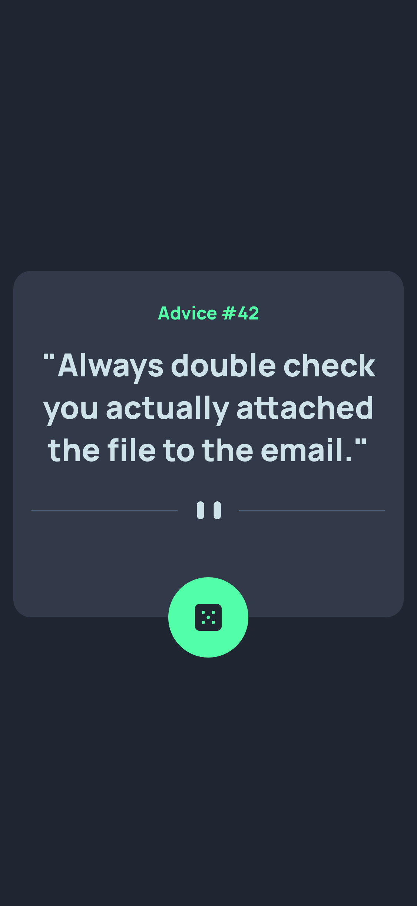

# Frontend Mentor - Advice generator app solution

This is a solution to the [Advice generator app challenge on Frontend Mentor](https://www.frontendmentor.io/challenges/advice-generator-app-QdUG-13db). Frontend Mentor challenges help you improve your coding skills by building realistic projects.

## Table of contents

- [Overview](#overview)
  - [The challenge](#the-challenge)
  - [Screenshot](#screenshot)
  - [Links](#links)
- [My process](#my-process)
  - [Built with](#built-with)
  - [What I learned](#what-i-learned)
  - [Useful resources](#useful-resources)
- [Author](#author)

## Overview

### The challenge

Users should be able to:

- View the optimal layout for the app depending on their device's screen size
- See hover states for all interactive elements on the page
- Generate a new piece of advice by clicking the dice icon

### Screenshot



### Links

- Solution URL: [Solution URL](https://www.frontendmentor.io/solutions/advice-generator-9JwGHsVQ81)
- Live Site URL: [Live Site URL](https://r1v3ra-1508.github.io/advice-generator-app-main)

## My process

### Built with

- CSS custom properties
- Flexbox
- Mobile-first workflow

### What I learned

I learned how to work with API:

```js
fetch(apiurl + id)
        .then(response => {
          if (!response.ok) {
            throw new Error('Network issue bruh');
          }
          return response.json()
        })
        .then(data => {setText(data)})
        .catch(error => {console.error('Error:', error)});
      }
}
```

### Useful resources

- [W3Schools](https://www.w3schools.com) - Legend

## Author

- Frontend Mentor - [@r1v3ra-1508](https://www.frontendmentor.io/profile/r1v3ra-1508)
